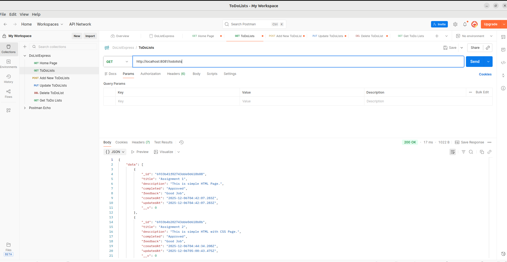
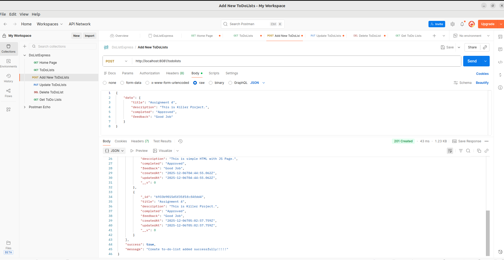
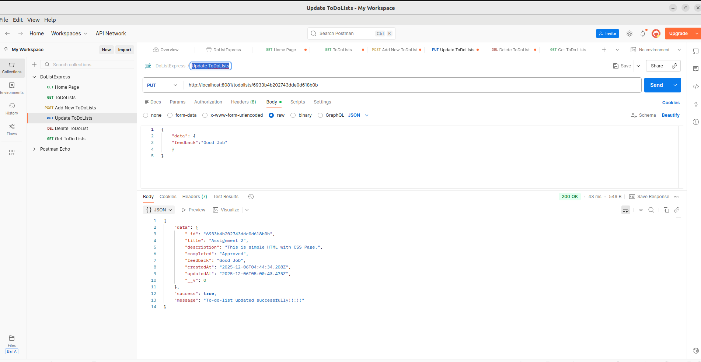
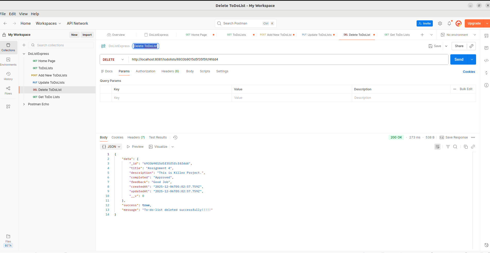
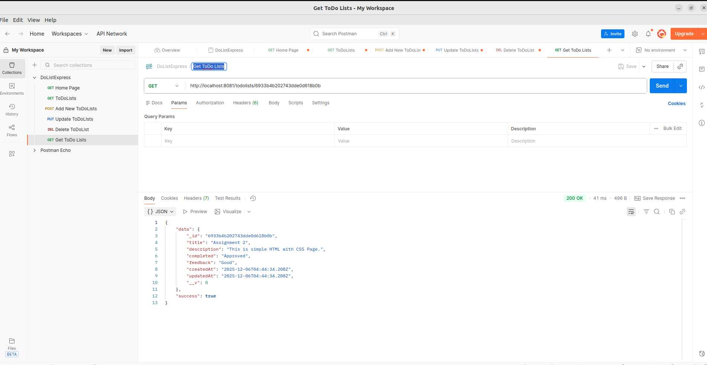

# ToDo List Front End Github Link
https://github.com/ladganesh22-cloud/toDoListFronend

# Netlify Deployment Link
https://rtodolistsapp.netlify.app/

# ToDo List Back end GitHub Link
https://github.com/ladganesh22-cloud/toDoListBackend

# GET Method ToDoList API
http://localhost:8081/todolists

# POST Method ToDoList API
http://localhost:8081/todolists

# PUT Method Update ToDoList API
http://localhost:8081/todolists/6933b4b202743dde0d618b0b

# Delete Method ToDoList API
http://localhost:8081/todolists/6933b9015d5f35f5fcf4fdd4

# GET Method ToDoList By ID API
http://localhost:8081/todolists/6933b4b202743dde0d618b0b

